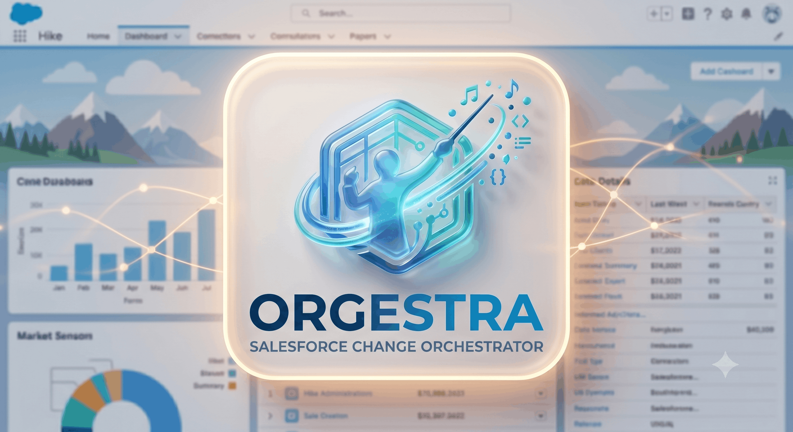

# Orgestra — Salesforce Change Orchestrator



**Orgestra** is a Salesforce org management tool that tracks and displays metadata changes across your org in near real time.

It polls ~279 metadata types every 10 minutes via the Tooling API and standard SOQL, stores the results in a custom object, and presents them through a filterable Lightning Web Component dashboard.

---

## Deployment

### Prerequisites

- [Salesforce CLI (`sf`)](https://developer.salesforce.com/tools/salesforcecli) installed.

### Deploy & Initialize - 3 Options

#### 1. With One Click

<a href="https://githubsfdeploy.herokuapp.com?owner=O-ELMA&repo=orgestra">
  
</a>

#### 2. Via the CLI

```bash
# Clone
git clone https://github.com/O-ELMA/orgestra && cd orgestra

# Authorise the Org via the command or the VSCode GUI
sf org login web --alias <alias> --instance-url https://login.salesforce.com --set-default

# Deploy via the command or the VSCode GUI
sf project deploy start --target-org <alias>

# Run post-deploy initialization
sf apex run --target-org <alias> --file scripts/apex/postDeploy.apex
```

#### 3. Via the VSCode GUI

1. Download the [ZIP](https://github.com/O-ELMA/orgestra/archive/refs/heads/master.zip) then unzip it
2. Open it the unzipped folder with VSCode
3. Authorise the Org you want to deploy to
4. Right click the `manifest/package.xml` and choose *Deploy Source in Manifest to Org*
5. Go to the ***Developer Console***
6. Open ***anonymous Apex***
7. Copy & Paste the following code below

```apex
// Full historical sync
MetadataChangeSyncScheduler.syncAll();

// Set up the recurring 10-minute schedule
MetadataChangeSyncScheduler.scheduleEveryTenMinutes();
```

---

## Usage

1. Navigate to the **Orgestra** app in your Salesforce org.
2. The home page displays the **Metadata Changes** component.
3. Use the filters to narrow results by type, API name, date, or user.
4. Click the refresh button to load the latest data.

The dashboard reflects the state of `Metadata_Change__c`, which is kept current by the background batch job running every 10 minutes.
